My Own Portfolio 
===
*Deployed on  : https://www.hatemdeux.com via GitHub-Pages.*
___

> #### **Influence-Credits** :
  > * The visual layout and color design of this website is influenced by the famous [Jack's](https://jacekjeznach.com/) previous portfolio design. 
  > * No code influence. Code is totally me.

> #### **DISCLAIMER** : 
  > * This website is limited to Front-End only to save costs.
  > * Lots of Data for this website are **sensitive** or **personal** and **are `.gitignored`**. 
  > * This repo is meant as a remote repo and a show of work. not  for cloning.
  >    * If you try cloning and running, it will break due to missing data imports. This is done on purpose.
  > * For further information on the Data & DataStructure, See [DATA_STRUCTURE.md](./DATA_STRUCTURE.md).

   
   

## Change Log
- Check [CHANGELOG.md](./CHANGELOG.md).

## Purposes of Website
This Website acts as :
- A Portfolio & show of work
- A Demo in itself, build from scratch with React and Vanilla-CSS.
- An opportunity to: 
  - Strengthen React skills.
  - Strengthen my CSS skills (including animation for the first time) and fill gaps of its knowledge.
  - Get exposed to SVG.
  - Strengthen Front-end skills.
  - Learn some design patterns.
  - Learn some DevOps (1st).

   
   

# Screenshots

## Home | Accueil
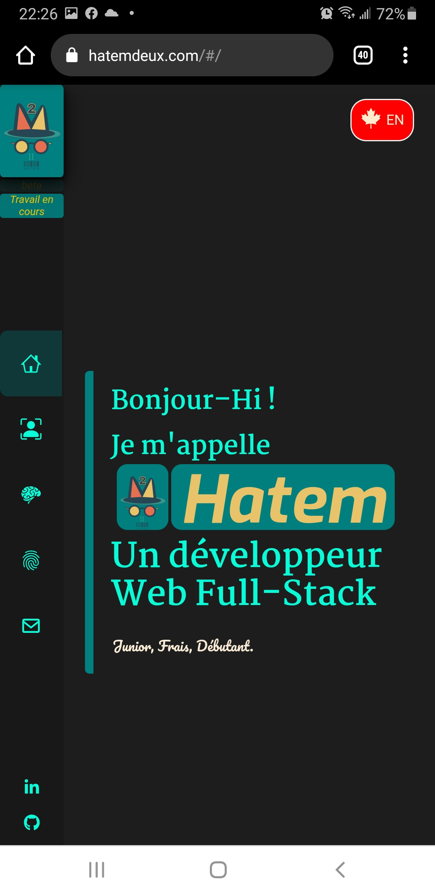
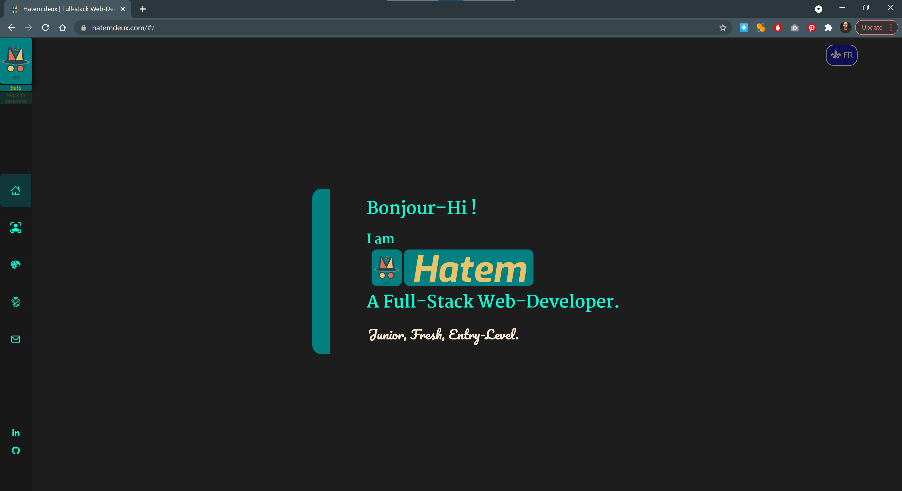

## About | À Propos
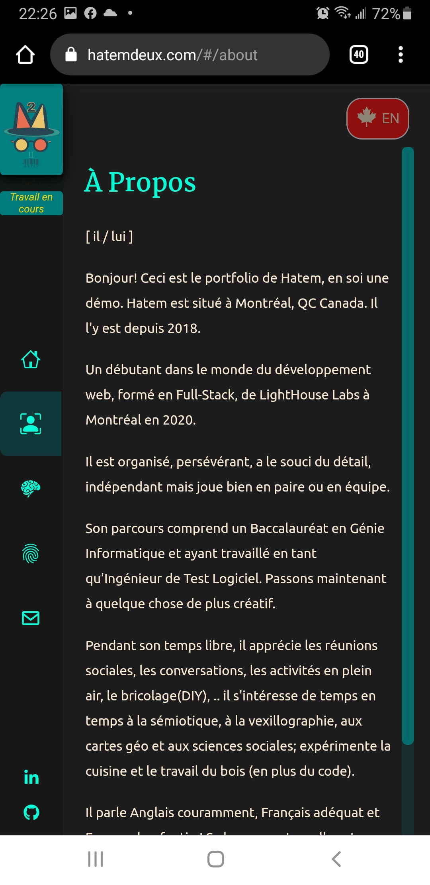
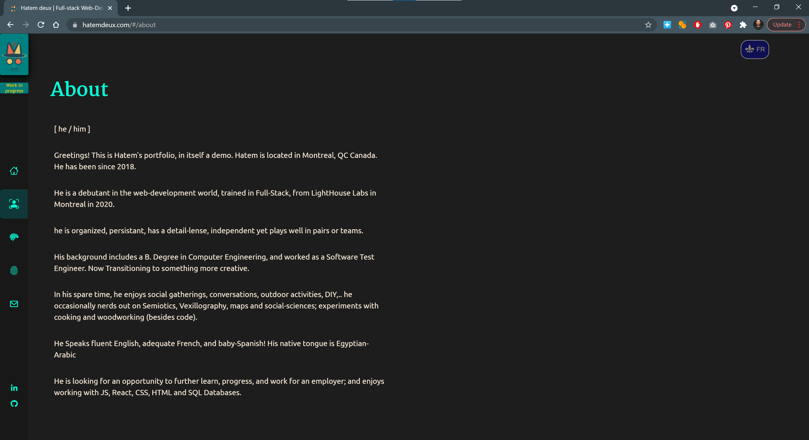

## Skills | Compétence
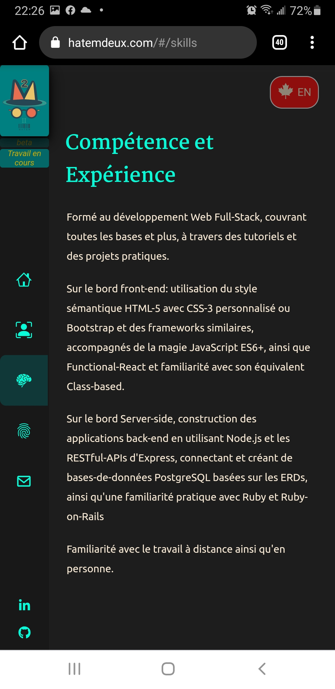
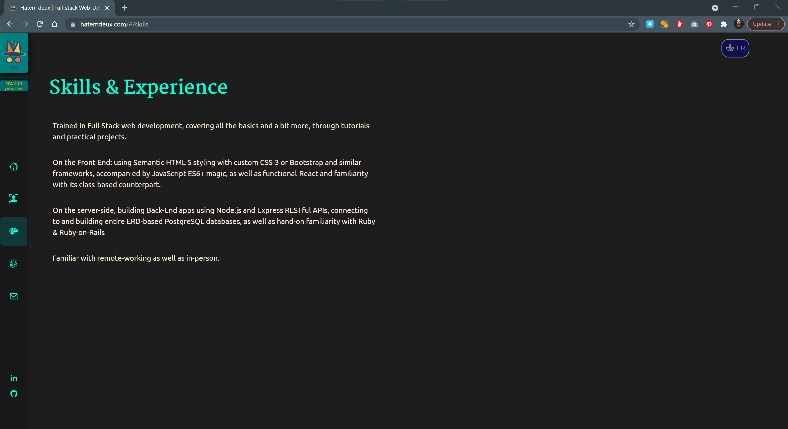

## My Work (Projects) | Mon Travail (Projets)
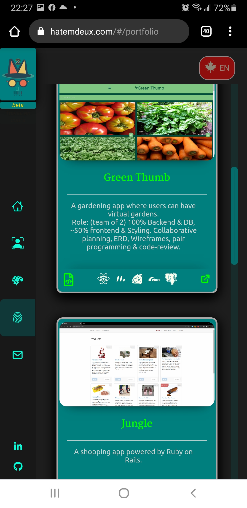
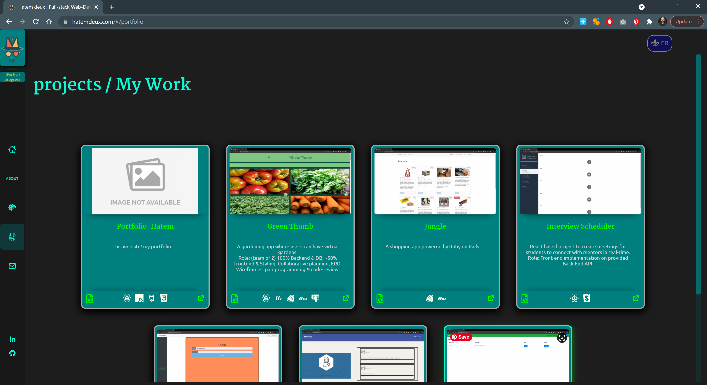

## Contact | Contact
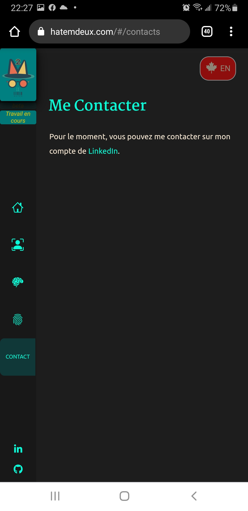
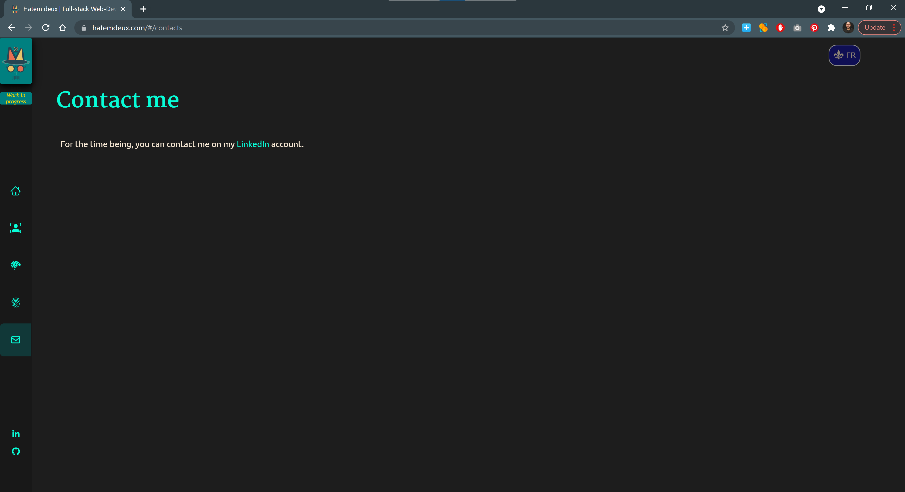

   
   

# Features & Walkthrough
> ***Disclaimer :*** Not tested on Apple/Safari.

## # Responsive Design
This Web-app works well on big screens as well as small mobile screens.

## # Bilingualism (EN/FR)
This web-app is bilingual (Canadian-English & Québec-French), reflecting my location: *Montréal, QC, Canada*. 
* press the top-right button to toggle between both languages.

## # Header / Navigator
On your left, a vertical "Header" is displayed, divided into 3 parts:
1. The Logo & below it a temp message if any (e.g '`beta`' or '`work in progress`')
2. The navigation tabs / buttons
3. a list of referencial social-network profiles icons. (e.g. '`LinkedIn`', '`GitHub`', ...)

## # Logo
An SVG-component amateurly designed by yours truly using *[Figma](https://www.figma.com/)*. \
*(i.e. couldn't afford it done professionally).*
> ### Fun-Fact : 
> The logo reflects my name: "*Hatem deux*" -> "Hat-em-2": 
> - a Hat
> - the hat's top section is shaped as an "M" == "em"
> - a number 2 at the very top and as a Roman-numeral as the nose.
> - the mustache and mouth as "Hatem" in Barcode and typed under.
> - the glasses.. well because I wear them. :)
> 
> 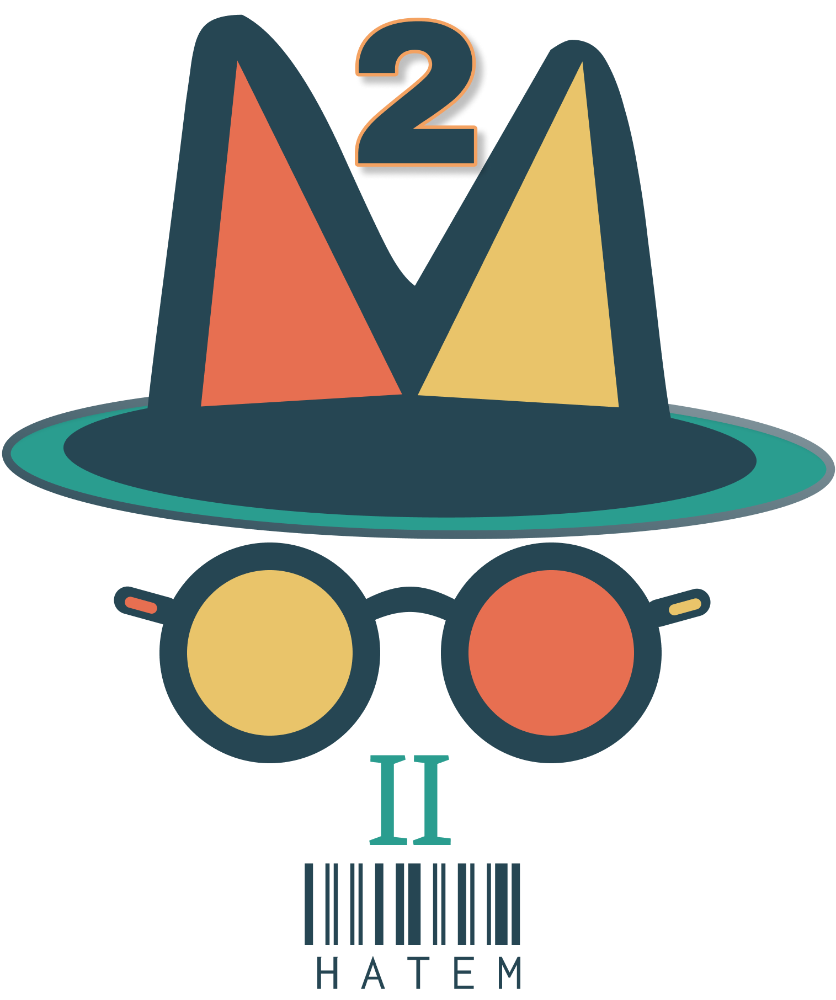

## # Divisions / Tabs
The portfolio-app is divided into ***`5`*** parts displayed as navigation tab-buttons:
1. ***Home | Accueil*** : the welcome page.
2. ***About | À Propos*** : a little about how I am.
3. ***Skills | Compétence*** : a little about my skill set.
4. ***My Work | Mon Travail*** : a list of projects I made or participated in.
5. ***Contact | Contact*** : How to contact me.

* All but the ***"My Work | Mon Travail"*** tab are straight forward.

### # ***" My Work | Mon Travail "*** Tab
Each project is represented as a vertical game-like card (think 'Monopoly'), divided into 4 parts:
1. The screenshot image.
2. The project's title 
3. The description and my role (if any).
4. The footer: consisting of 3 parts:
    1. an external-link to project's repo (opens a new page)
    2. a list of icons representing the Project's stack
    3. an external-link to project's deployed-website (if any) (opens a new page)

   
   

# Technical-Stack
  ### Front- End : 
  * HTML & Vanilla CSS.
  * React JS: Functional-components
  ### Back-End : 
  * Intentional no back-end to save costs. Data has been saved in a series of `.json` files or within *React-Components*.
  ### Database :
  * No database system (no back-end)
  * Much of data are stored in `.json` files mostly under the **`.gitignored`** *`db`* directory located at `./src/db/`.
  * Logic behind .json files is to let it be upgrade-ready shall a back-end is installed in the future.
  * For more information on the Data & DataStructure, See [DATA_STRUCTURE.md](./DATA_STRUCTURE.md).

  ### Dependencies :
    React:
      react: 17.0.1
      react-dom: 17.0.1
      react-scripts: 4.0.1
    react-router-dom: 5.2.0
    react-icons: 4.1.0
    react-responsive: 8.2.0
    typewriter-effect: 2.17.0
  ### DevDependencies :
    gh-pages: 3.2.0

## Project Setup Steps
> This is just for show of work. it is not meant for cloning or installing on your system.
* `npx create-react-app`
* `yarn add` | or | `yarn add <dependency>`
  * `yarn add <devDependency> --dev`
* `yarn deploy`, which will: 
  * `yarn build` (added to `package.json`'s `scripts` as `predepoly`)
  * `gh-pages -d build` (added to `package.json`'s `scripts` as `depoly`)

 
 
 

---
#### Other Documentation :
* Go to the [data Structure](./DATA_STRUCTURE.md).
* Go to the [changelog](./CHANGELOG.md).
--- 
